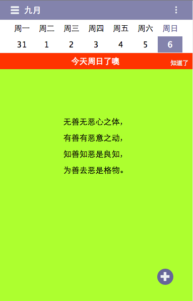
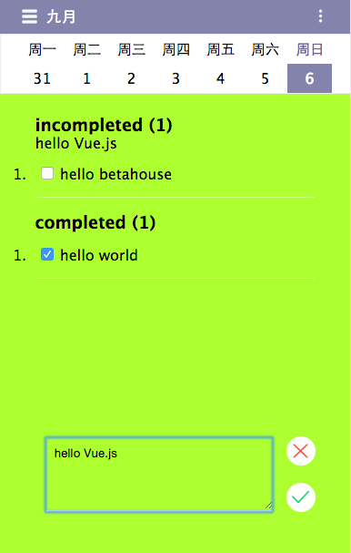
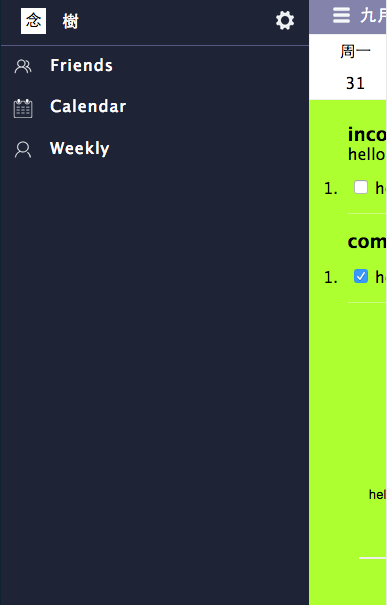
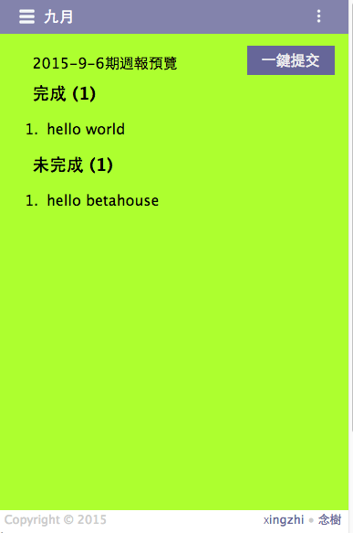

##行之

行之 是為betahouse開發的週報管理應用

行之 之名  取自 王陽明  知行合一


####歡迎頁面


####登錄頁面


####個人主頁



####添加任務



####左邊側欄
  


####預覽週報



###Build

```
$ git clone git@github.com:ahbing/xingzhi.git

$ npm install

$ npm run dev

$ npm start

```

###License

MIT License

